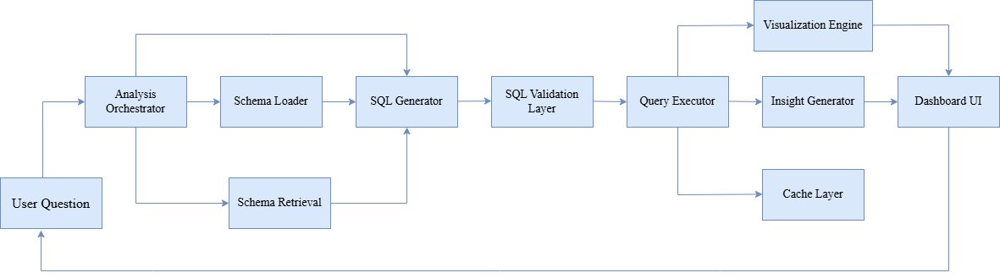
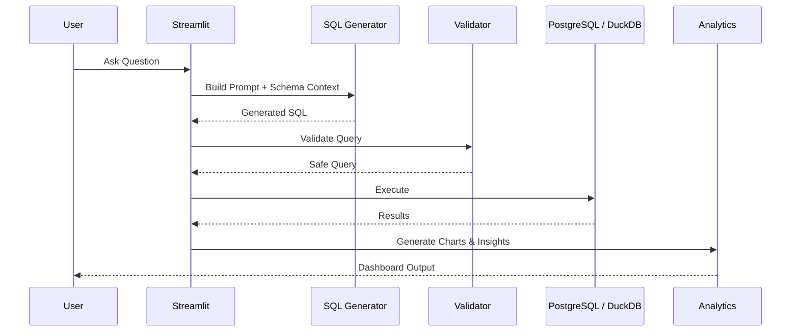
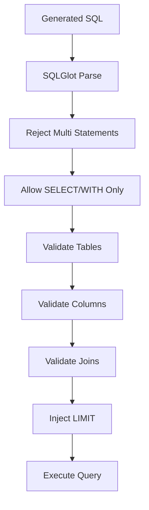

# InsightDesk

InsightDesk is a natural language analytics tool that converts business questions into SQL queries, executes them safely, and returns visualizations and insights.

---

## Features

### Natural Language → SQL

* Convert business questions into SQL
* Schema-aware prompt construction
* PostgreSQL dialect support
* Ambiguity detection and clarification
* Automatic query correction on execution failures

### Query Validation & Safety

* SQLGlot AST validation
* Read-only query enforcement
* Multi-statement blocking
* Table validation
* Column validation
* Join validation
* Automatic LIMIT injection
* Query timeout protection

### Analytics

* PostgreSQL execution engine
* DuckDB execution engine
* CSV uploads
* Excel uploads
* Parquet support
* Query history tracking

### Visualizations

* Automatic chart recommendations
* Interactive Plotly visualizations
* KPI cards
* Trend analysis
* Distribution analysis

### Insight Generation

* Trend detection
* KPI extraction
* Comparative analysis
* Anomaly detection
* Business-oriented summaries

### Infrastructure

* Docker support
* Redis caching
* Provider abstraction layer
* Environment-based configuration

---

## Architecture

<p align="center">

</p>

---

## End-to-End Query Flow



---

## SQL Validation Pipeline



---

## Technology Stack

### Backend

* Python
* SQLAlchemy
* PostgreSQL
* DuckDB

### AI Layer

* Groq
* OpenRouter
* Optional Gemini Support

### Validation

* SQLGlot

### Retrieval

* Sentence Transformers
* FAISS

### Visualization

* Plotly

### Frontend

* Streamlit

### Infrastructure

* Docker
* Docker Compose
* Redis

---

## PostgreSQL and DuckDB

The project supports two execution modes.

### PostgreSQL

Used for:

* relational datasets
* transactional workloads
* production-style analytics

### DuckDB

Used for:

* CSV analytics
* Excel analytics
* Parquet analytics
* local analytical workloads

Supporting both allows the application to work with traditional databases and ad-hoc datasets.

---

## Project Structure

```text
InsightDesk/
│
├── app.py
│
├── backend/
│   ├── db/
│   ├── llm/
│   ├── security/
│   ├── retrieval/
│   ├── visualization/
│   └── insights/
│
├── cache/
├── logs/
├── tests/
│
├── docker-compose.yml
├── Dockerfile
├── requirements.txt
└── README.md
```

---

## Local Setup

### Create Virtual Environment

```powershell
python -m venv .venv
.\.venv\Scripts\activate
```

### Install Dependencies

```powershell
pip install -r requirements.txt
```

### Configure Environment Variables

```powershell
copy .env.example .env
```

Example:

```env
LLM_PROVIDER=groq
GROQ_API_KEY=your_api_key
```

### Run Application

```powershell
streamlit run app.py
```

Open:

```text
http://localhost:8501
```

---

## Docker

Run the complete stack:

```powershell
docker compose up --build
```

Services:

| Service     | Port |
| ----------- | ---- |
| InsightDesk | 8501 |
| PostgreSQL  | 5432 |
| Redis       | 6379 |

---

## Example Workflow

### User Question

```text
Show total revenue by region
```

### Generated SQL

```sql
SELECT
    region,
    SUM(order_amount) AS revenue
FROM sales
GROUP BY region
ORDER BY revenue DESC;
```

### Output

* Results table
* KPI cards
* Interactive chart
* Business summary

Example insight:

```text
The West region generated the highest revenue and contributed 42% of total sales.
```

---

## Tradeoffs

* Uploaded files are treated as session datasets.
* SQL validation prioritizes safety over flexibility.
* Schema retrieval focuses on metadata rather than business documentation.
* Insight generation produces concise summaries instead of detailed reports.

---

## Future Improvements

* Role-based access control
* Saved dashboards
* Scheduled reports
* Additional database connectors
* Data lineage tracking
* Query observability
* Team workspaces

---

## Testing

Run all tests:

```powershell
pytest tests
```

Coverage includes:

* SQL validation
* Schema retrieval
* Query history
* Visualization engine
* Cache behavior
* Insight generation
* Startup checks

---
